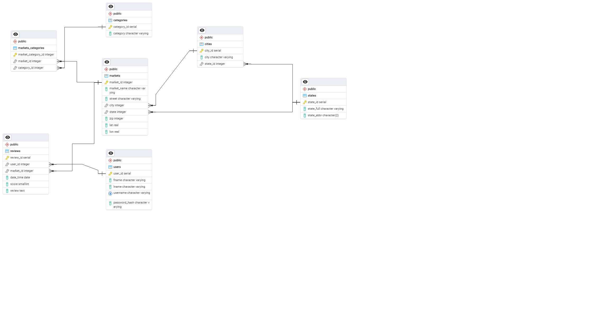

# Итоговое зачетное задание по курсу Python
Реализовать следующие функции с помощью функционального программирования:
1.	Просмотр списка всех фермерских рынков в стране (включая рецензии и рейтинги) с разбивкой по страницам;
2.	Функция поиска фермерского рынка по городу и штату, а также по почтовому индексу с возможностью ограничить зону поиска определенной дальностью;
3.	Просмотр подробных данных о любом рынке, присутствующем в поисковой выдаче;
4.	Функция просмотра, добавления и удаления рецензии на любой фермерский рынок, состоящие из необязательного текста рецензии и обязательного рейтинга (от 1 до 5 звезд);
5.	Рецензии создаются привязанными к имени и фамилии пользователя;
6.	Распределять рынки по различным критериям (ргороду и штату) от минимального к максимальному значению или наоборот;
7.	Выход из программы.

В качестве исходного источника данных выступает файл Export.csv. При этом  данные из этого файла загружены в базу данных PostgreSQL, схема которой представлена ниже. Приложение взаимодействовует с СУБД, а не с файлом CSV.

#### Инструкция по установке
> cd <каталог проекта>
> 
> python -v venv .venv
>
> .venv\Scripts\Activate
> 
> pip install -r requirements.txt
> 
> python db.py 
> 
> python console-ui.py

В файле requirements.txt перечислены необходимые библиотеки (psycopg2).
Активируем виртуальное окружение, добавляем библиотеку.
Скрипт db.py за счет секции __init__ выполнит ETL-парсинг исходных CSV
Консольный интерфейс работы с проектом обеспечит скрипт console-ui.pe

### Описание модулей
#### etl
работа с исходным csv, подготовка вспомогательных CSV, требует наличия Export.csv и state_abbr.csv

#### db
* def connection_postgres() - подключение к стандартной базе PostgreSQL для создания БД
* def connection_DB(DB_name) - подключение к БД с определённым именем
* def create_DB_and_Role(DB_name) - создание БД и Роли, если ещё не созданы (выполняется при запуске программы)
* def create_tables_DB(DB_name) - создание таблиц БД
* def filling_tables_DB(DB_name) - заполнение значениям по умолчанию таблиц БД

#### util
модуль для расчёта расстояния между 2мя точками.

ВАЖНО, расчет в милях!

#### model
* def all_markets_full() - подготовка словаря рынков, с отзывами, оценками
* def all_markets_full() - подготовка словаря рынков, из исходных данных
* def market_by_id(id) - значение рынка по ключу
* def market_by_id_full(id) - значение рынка по ключу, более подробно
* def id_by_location(city, state) - список рынков по городу и штату
* def id_by_zip(zip) - список рынков по почтовому индексу
* def id_by_zip_and_distance(zip, distance) - список рынков по почтовому индексу и расстоянию до него (в милях)
* def new_user(fname, lname, username, password) - добавление в таблицу пользователя (обязательно уникальный username)
* def find_user_id(username, password) - поиск пользователя по id
* def new_review(user_id, market_id, score, review) - добавление рецензии, обязательно соблюдение ключей user_id и market_id (вводить существующие)
* def get_review(market_id) - получение отзывов о конкретном рынке
* def get_reviews(username, password) - получение отзывов определенного пользователя
* def delete_review(id) - удаление отзыва по id
* def sort_by_state_city(sort) - сортировка рынков по штату и городу в обратном порядке

### Работа с приложением console-ui
* def paginate_ функции обеспечивают разбивку по страницам (5 элементов)
* ведется учет страниц <номер текущей> / <номер максимальной>
* навигация по страницам: n - next | p - previous | e - exit

#### Меню:
0. Exit - выход из программы
1. Show all markets - вывод данных о всех рынках (без подробностей)
2. Find markets by city and State - вывод данных о рынках в указанном городе и штате
3. Find markets by zip - вывод данных о рынках по индексу, и в указанном радиусе от первого найденного рынка с этим индексом
4. Next menu - переход в следующее меню

#### Дополнительное меню:
1. Show full info - по id рынка показывает полную информацию
2. Leave feedback - возможность ввести логин пароль, оставить оценку и отзыв, если пользователя не существует, юудет создан новый
3. Delete feedback - по пользователю находит оставленные отзывы и предлагает по id отзыва его удалить
4. Sort by state and city - аналог Show all markets основного меню, но отсортированный в обратном порядке по городу и штату 
